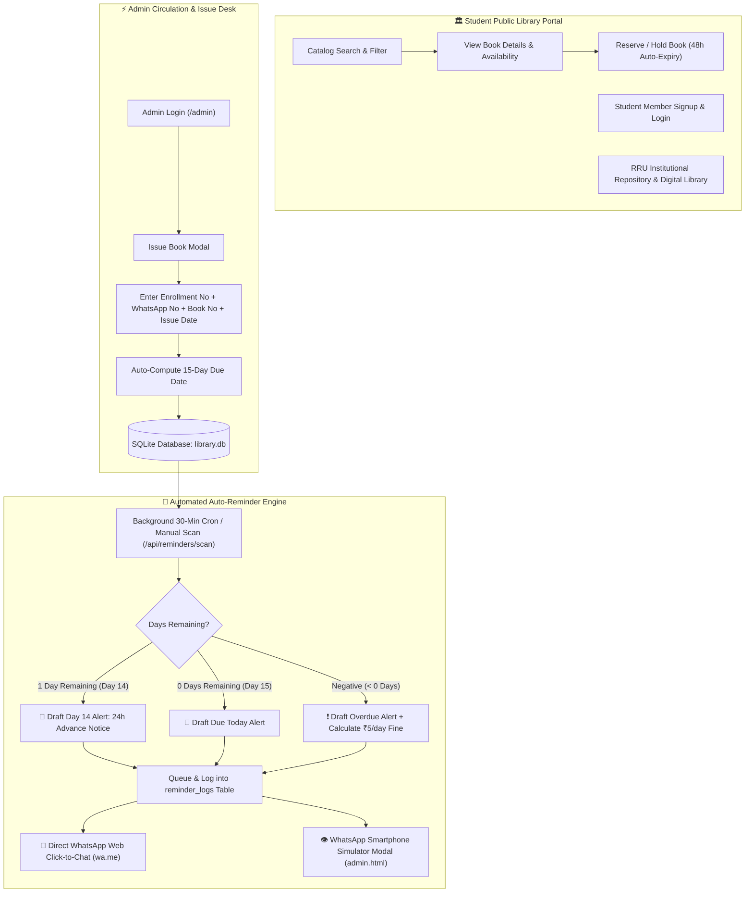
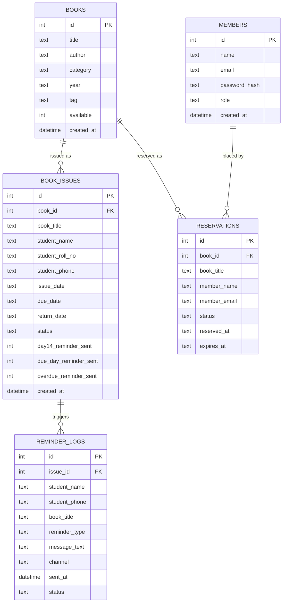

# 📚 THE SMART LIBRARY · Automated Circulation & WhatsApp Reminder System

[](https://github.com/abhi23gaur07/the-smart-library)
[](https://nodejs.org/)
[](https://expressjs.com/)
[](https://www.sqlite.org/)
[](https://www.whatsapp.com/)
[](LICENSE)

> **"Break the forgetfulness link — Prevention over punishment."**  
> An intelligent, full-stack digital library management system featuring an **Automated WhatsApp 24-Hour Return Notice Engine**, 15-day loan tracking, live fast-forward scenario simulator, interactive circulation desk, and institutional data integration aligned with **Rashtriya Raksha University (RRU) - Library & Learning Resources Branch (LLRB)**.

---

## 🎯 Executive Overview & Problem Statement

### ❌ The Core Challenge in Academic Libraries
In traditional university and institutional libraries:
1. **Ineffective Communication Channels**: Return notices and fine warnings are predominantly sent via email, where they sit unread in crowded inboxes or spam folders.
2. **Punishment over Prevention**: Existing systems wait until the loan window expires to penalize students with overdue fines, creating student friction and leaving library books out of circulation for weeks.
3. **Lack of Instant Awareness**: Students actively use WhatsApp throughout the day, yet library management systems remain disconnected from direct, high-open-rate mobile messaging.

### ✅ The Smart Library Solution
**THE SMART LIBRARY** introduces an automated proactive circulation framework:
- **15-Day Loan Cycle with Day 14 Alert**: At the time of book issue, the student's **Enrollment Number** and **WhatsApp Number** are collected. Exactly on **Day 14** (24 hours before the 15-day due date), the system automatically crafts and queues an urgent WhatsApp reminder:  
  *“Tomorrow is the last date of your loan period. Please renew or return the book back to prevent late fines.”*
- **Day 15 (Due Date) Notice**: Instant morning alert advising return before desk closing hours.
- **Day 16+ Overdue Escalation**: Daily late fine accrual calculation (₹5/day) with clear settlement instructions.
- **Interactive Fast-Forward Simulation Engine**: Built-in testing suite allowing administrators and hackathon evaluators to instantly jump any loan to Day 14, Due Date, or Overdue status in 1 click without waiting weeks.
- **Realistic WhatsApp Smartphone Simulator**: An in-browser mobile phone mockup with verified delivery ticks (`✓✓`) demonstrating the exact student messaging experience.

---

## 🏗️ System Architecture & Workflow



---

## ✨ Key Features & Capabilities

### 1. 📋 Automated Circulation & Book Issue Desk (`admin.html`)
- **Student Data Capture**: Input Student Full Name, Enrollment No / Roll No, and WhatsApp Number.
- **Smart Phone Number Normalization**: Automatically validates and prefixes international country codes (defaulting to India `+91` for 10-digit mobile numbers).
- **Auto-Calculated 15-Day Due Date**: Real-time due date computation updating immediately when issue date changes.
- **Dynamic KPI Dashboard**:
  - 📖 **Active Book Loans (15d)**
  - ⚠️ **Day 14 Alerts (24h to Due)** with pulsing warning indicator
  - 🚨 **Due Today & Overdue Loans**
  - 💬 **Total WhatsApp Reminders Dispatched**

### 2. 📱 Automated WhatsApp Notification Engine
- **Pre-Drafted Personalized Templates**: Every alert includes the student's name, enrollment ID, book title, issue date, due date, and circulation instructions.
- **Sample Day 14 Notice**:
  ```text
  📚 *THE SMART LIBRARY · RRU LLRB*
  *Automated Return Reminder* 🔔

  Hello *Rahul Sharma* (Enrollment No: *2026RRU-CS042*),

  This is an automated 24-hour reminder regarding your borrowed library book:
  📖 *Cyber Security & Digital Forensics: Investigation Blueprint*
  📅 *Date of Issue:* 2026-09-11
  ⏰ *Return Due Date:* *Tomorrow, 2026-09-26* (Day 14 of 15-day loan)

  Tomorrow is the last date of your loan period. Please renew or return the book back to the Central Circulation Desk to prevent late fines.

  _Break the forgetfulness link — Prevention over punishment._
  ```
- **Real WhatsApp Click-to-Chat**: Direct integration using `https://wa.me/<phone>?text=<encoded_message>` launching WhatsApp Web or mobile app instantly.
- **Interactive WhatsApp Phone Simulator**: High-fidelity dark-themed smartphone viewport with authentic WhatsApp chat bubbles, timestamping, and delivery checkmarks.

### 3. ⏩ Fast-Forward Live Demonstration Suite
Evaluators and audiences do not need to wait 14 days to observe automated reminders:
- `⏩ Day 14`: Instantly shifts the loan timeline so 14 days have elapsed and 1 day remains.
- `🚨 Due Day`: Fast-forwards the loan to Day 15 (due today).
- `❗ Overdue`: Shifts the loan to Day 18 (3 days overdue, accruing ₹15 in late fines).

### 4. 📚 Student Public Portal (`library.html`)
- **Catalog Exploration**: Real-time search across Cyber Security, Digital Forensics, National Security, Law, Criminology, and AI.
- **Live Hold / Reservation Desk**: Immediate reservation with a 48-hour pickup window.
- **Institutional Integration**: Direct data mapping with **Rashtriya Raksha University LLRB** metrics (15,131+ print books, 5,12,324+ ebooks, 17,533+ e-journals, Koha-LMS, and MyLOFT remote access).
- **Interactive UI**: Custom electric blue particle cursor trail, glassmorphism cards, and responsive layouts.
- **3D Digital Mine / Model Viewer (`view_3d_mine.html`)**: WebGL `.glb` 3D model inspection for technical research disciplines.

---

## 🗄️ Database Schema (`library.db`)

The system utilizes an optimized SQLite database with **Write-Ahead Logging (`WAL` mode)** for high-concurrency read/write transactions:



---

## 🔌 RESTful API Reference

| Method | Endpoint | Description |
|---|---|---|
| `GET` | `/api/books` | Fetch all catalog books with availability status |
| `POST` | `/api/books` | Add a new book to the library catalog |
| `DELETE` | `/api/books/:id` | Remove a book from the catalog |
| `GET` | `/api/issues` | List all book loans with calculated loan cycle metrics |
| `POST` | `/api/issues` | Issue a book (collects Enrollment No, Phone, Issue Date, Due Date) |
| `POST` | `/api/issues/:id/return` | Mark book as returned and restore catalog availability |
| `POST` | `/api/issues/:id/simulate` | Fast-forward loan to `day14`, `day15`, `overdue`, or `day1` |
| `POST` | `/api/reminders/generate-whatsapp` | Generate pre-drafted WhatsApp URL and message text |
| `POST` | `/api/reminders/scan` | Execute automated scan to detect and queue Day 14 & Due reminders |
| `GET` | `/api/reminders/logs` | Fetch historical dispatch logs of sent reminders |
| `POST` | `/api/admin/login` | Authenticate admin session |
| `GET` | `/api/stats` | Real-time analytics (Books, Members, Day 14 count, Reminders sent) |
| `GET` | `/api/rru-info` | Official RRU LLRB institutional data and collection metrics |

---

## 🚀 Quickstart & Installation

### Prerequisites
- [Node.js](https://nodejs.org/) (v18.0.0 or higher recommended)
- `npm` (comes bundled with Node.js)

### 1. Clone the Repository
```bash
git clone https://github.com/abhi23gaur07/the-smart-library.git
cd the-smart-library
```

### 2. Install Dependencies
```bash
npm install
```

### 3. Launch the Server
```bash
node server.js
```

### 4. Open in Browser
- **Student Public Portal**: [`http://localhost:3000`](http://localhost:3000)
- **Admin Circulation Desk**: [`http://localhost:3000/admin`](http://localhost:3000/admin)
  - **Username:** `admin`
  - **Password:** `admin1234`
- **3D Model Viewer**: [`http://localhost:3000/view_3d_mine.html`](http://localhost:3000/view_3d_mine.html)

---

## 🛠️ Technology Stack

| Layer | Technology |
|---|---|
| **Frontend** | HTML5, CSS3 Custom Properties, Modern JavaScript (ES6+), Canvas 2D (Particle Cursor), Google Model Viewer |
| **Backend** | Node.js, Express.js (RESTful Routing, CORS, JSON Middleware) |
| **Database** | SQLite3 / `node:sqlite` (DatabaseSync engine, WAL journaling, foreign keys) |
| **Messaging** | WhatsApp Click-to-Chat Protocol (`wa.me`), WhatsApp Cloud API Ready |
| **DevOps / Cloud** | Git, GitHub, Render (`render.yaml`), Vercel Compatible |

---

## 👨‍💻 Author & Developer Profile

**Abhishek Gaur**  
*Full-Stack Engineer & AI/Systems Developer*  
- **GitHub**: [@abhi23gaur07](https://github.com/abhi23gaur07)
- **Specialization**: Full-Stack Web Architecture, Autonomous AI Agents, Database Engineering, and Hackathon Solutions (Smart India Hackathon).

---

## 📄 License
This project is open-source and distributed under the [MIT License](LICENSE).
